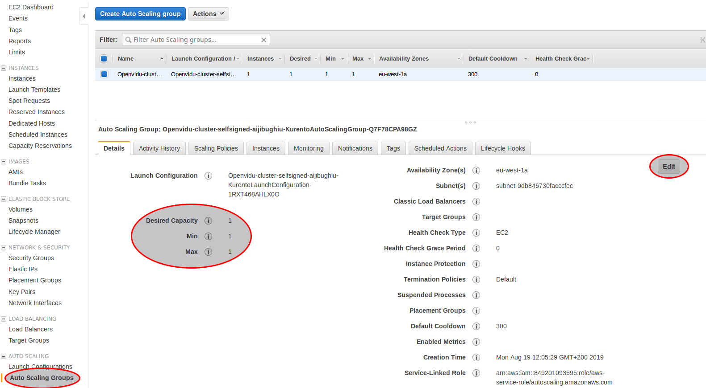
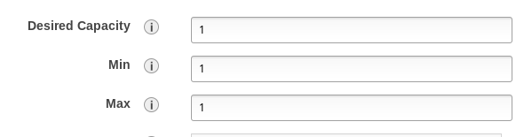

# Simple Scaling

## Introduction

Media servers run in an AWS AutoScaling Group. Which means that it can be scaled to any number of media servers you want to use.

**WARNING:** Keep in mind the more media servers you use the more expensive  this solution will be.

## Changing cluster size

Go to AWS Dashboard -> AutoScaling Groups:

You'll see three values:

- **Desired Capacity**: Is the number of instances we want to keep up and running.
- **Min**: Is the minimum number of instances we want to keep up and running.
- **Max**: Is the maximum number of instances we want to keep up and running.

So, as an example, if we want to stop the cluster we could set **Desired Capacity** and **Min** values to zero.

But, if we want to scale up we must set **Desired Capacity** and **Max** values to the values we want.

Once we've made the changes we can shutoff the OpenVidu Server instances if we want to stop the cluster completely or reboot it so that the server takes the changes in cluster size.

